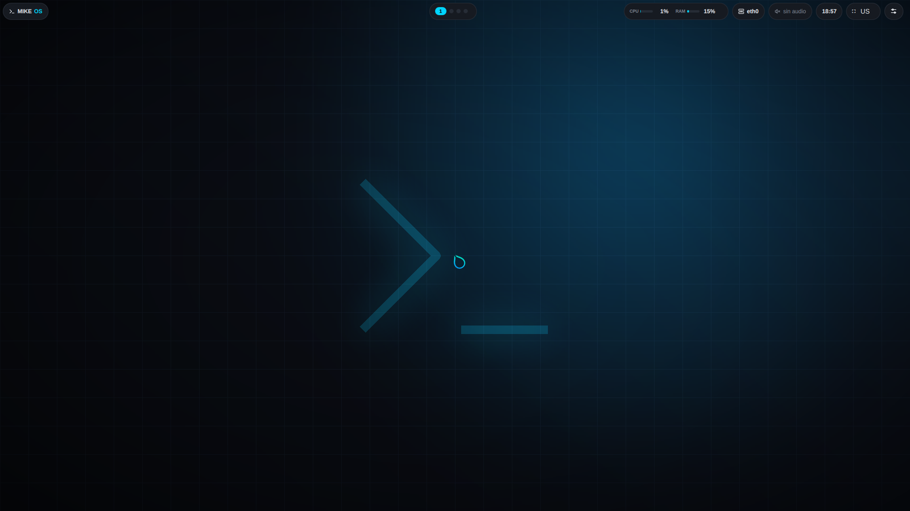
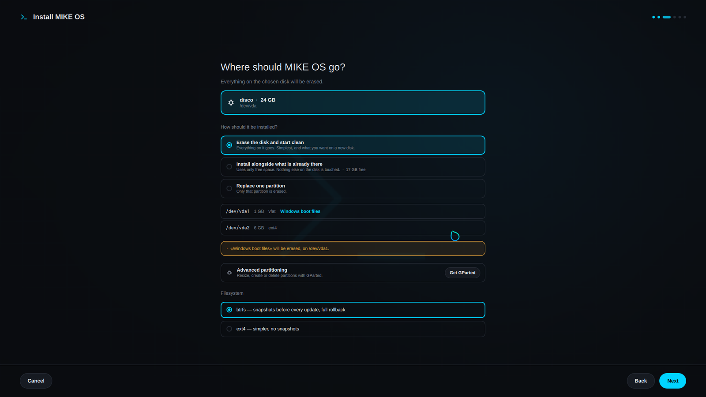

<div align="center">


# MIKE OS

**Un sistema operativo hecho desde cero.**

Kernel Linux propio · init con runit · gestor de paquetes propio · shell propia
· escritorio propio · **cero systemd**

[](https://github.com/M1KE-27/m1keos/releases/latest)
[](LICENSE)
[](docs/kernel.md)
[](docs/boot.md)
[](#comprobar-que-funciona)

[**Web**](https://m1keos.duckdns.org/) ·
[Descargar](https://m1keos.duckdns.org/descargas.html) ·
[Documentación](https://m1keos.duckdns.org/docs/) ·
[Capturas](https://m1keos.duckdns.org/capturas/) ·
[Cambios](docs/CAMBIOS.md) ·
[*Read in English*](https://m1keos.duckdns.org/en/index.html)

</div>

---

> [!WARNING]
> **Versión alpha.** Arranca, se instala y se actualiza, y todo eso está
> probado de punta a punta: en QEMU con firmware UEFI real y en una Surface
> Laptop 4 física. En otros portátiles sigue sin probar. Si lo instalas, que
> sea en un equipo que puedas formatear.

| | |
|---|---|
| Arranque | **0,59 s** del kernel a la consola |
| Memoria | **324 MB** con el escritorio en pie |
| Compilar el sistema entero | **25 s** |
| systemd | **0 líneas** |
| Imagen | **479 MB** |



## Índice

- [Qué es esto](#qué-es-esto)
- [Probarlo](#probarlo)
- [Lo que todavía no funciona](#lo-que-todavía-no-funciona)
- [Construirlo](#construirlo)
- [Comprobar que funciona](#comprobar-que-funciona)
- [Actualizaciones](#actualizaciones)
- [Estructura](#estructura)
- [Colaborar](#colaborar)
- [Licencia](#licencia)

## Qué es esto

No es una distribución de Linux montada con piezas de otras. El kernel se
compila con una configuración propia, el init es runit con servicios escritos
para este sistema, y el gestor de paquetes, la shell, las herramientas y el
escritorio están escritos desde cero para MIKE OS.

**Arranca por dos caminos a la vez, y es a propósito.** GRUB va en
`EFI/BOOT/BOOTX64.EFI`, que es la ruta que prueba toda firmware sin necesidad
de registrar nada, y da menú: arrancar normal, ver los mensajes, entrar sólo a
consola si el escritorio no levanta. Además el kernel se compila con
`CONFIG_EFI_STUB`, así que él solo ya es un ejecutable UEFI válido y queda
registrado aparte como respaldo. Si GRUB desaparece, el equipo enciende igual.
No encender es el peor fallo que puede tener un sistema operativo.

### Las piezas

| Pieza | Qué es |
|---|---|
| **kernel** | Linux compilado para este sistema. Todo va dentro (`=y`): no se montan módulos |
| **runit** | Init y supervisión, PID 1 |
| **mpm** | Gestor de paquetes: SHA256, dependencias, instantáneas de btrfs antes de instalar, y rollback |
| **mkshell** | Shell en C: tuberías, redirecciones, variables |
| **mcore** | 35 herramientas del sistema: `m-install`, `m-doctor`, `m-drivers`, `m-energia`, `m-particiones`… |
| **instalador** | Gráfico, en QML. Detecta el disco, instala al lado de otro sistema y avisa de lo que va a borrar |
| **bloqueo** | Pantalla de bloqueo con `ext-session-lock-v1`, aviso de Bloq Mayús y salida si la cuenta no tiene contraseña |
| **escritorio** | Hyprland, con barra y Centro de Control escritos para MIKE OS en QML |
| **servidor** | Phoenix + PostgreSQL: índice de versiones y parque de equipos |

## Probarlo

```sh
# descarga desde https://m1keos.duckdns.org/descargas.html
sha256sum mikeos.iso                  # compara con el publicado
sudo dd if=mikeos.iso of=/dev/sdX bs=4M status=progress oflag=sync
```

Arranca en memoria: puedes mirarlo todo, abrir la terminal y apagar sin que el
disco se entere. Para instalarlo, el botón **Instalar MIKE OS** está en la
ventana de bienvenida.



El instalador detecta el disco solo (y nunca ofrece el USB del que has
arrancado), enseña qué hay en cada partición y avisa en ámbar de lo que se va a
perder. Si algo impediría que el equipo arrancara después, no deja continuar y
explica por qué.

**Instalar al lado de Windows** usa el espacio libre y no toca nada más. La
partición EFI que encuentre se conserva con el arranque de Windows dentro, que
es lo que hace que Windows siga apareciendo en el menú de GRUB en vez de
«desaparecer».

> [!IMPORTANT]
> **Secure Boot hay que desactivarlo.** Este kernel no lleva la firma de
> Microsoft, así que con Secure Boot activado la firmware se niega a
> ejecutarlo. En una Surface: mantén **subir volumen** mientras enciendes.

### Saber qué hardware tienes y qué le falta

```sh
m-drivers            # cada componente, y en cuál de cuatro estados está
m-hardware           # el informe largo: PCI y USB, driver, firmware y servicio
m-energia estado     # perfil de energía, alimentación y batería
```

`m-drivers` distingue **funciona**, **sin driver**, **le falta firmware** y
**detectado pero parado**. Son cuatro averías distintas con cuatro soluciones
distintas que desde fuera se ven todas igual: "no me va el wifi".

## Lo que todavía no funciona

Esto es parte de la documentación, no una nota al pie.

| | |
|---|---|
| **Secure Boot** | Hay que desactivarlo. El kernel no está firmado por Microsoft y no lo va a estar pronto |
| **Sólo UEFI** | No arranca por BIOS ni con CSM |
| **Particionado manual** | El instalador sabe borrar, instalar al lado y reemplazar. Para crear o redimensionar a mano, `mpm install gparted` |
| **Privilegios** | `m-sudo` da root a la cuenta sin pedir contraseña. El bloqueo protege de miradas, no de alguien con tiempo y teclado |
| **Hardware real** | Probado en QEMU con UEFI real y en una Surface Laptop 4. En otros portátiles, sin probar |

## Construirlo

Necesitas `gcc`, `make`, `git`, `qemu-system-x86_64`, `xorriso` y `mtools`.

```sh
./scripts/build.sh                       # la primera vez compila el kernel
./scripts/crear-iso.sh                   # USB/ISO arrancable
./scripts/run-qemu.sh --gui --desktop
```

> [!NOTE]
> **La ruta del proyecto no puede llevar espacios.** kbuild se niega en seco
> y el `make install` de BusyBox tampoco lo soporta.

Para poder entrar por SSH a la máquina de pruebas, pasa tu clave pública:

```sh
MIKEOS_SSH_AUTHORIZED_KEYS_FILE=~/.ssh/id_ed25519.pub ./scripts/build.sh
```

Las imágenes que se publican se construyen **sin** esa variable, y que
`authorized_keys` quede vacío se comprueba antes de subir nada: una clave de
desarrollo dentro de una imagen distribuida es acceso root para quien la mire.

## Comprobar que funciona

```sh
./tests/humo.sh                    # 39 comprobaciones sobre una máquina arrancada
./tests/raton-real.sh              # 11 comprobaciones con pulsaciones arrastradas
./tests/probar-arranque-uefi.sh    # arranca con firmware UEFI, sin trampas
./tests/arrancar-como-ventoy.sh    # la ISO como ARCHIVO dentro de una partición
./tests/actualizacion.sh           # editar código -> paquete -> mpm upgrade
./tests/medir-arranque.sh          # cronometra el arranque
./tests/barra-posiciones.sh        # la barra sobrevive a moverla de sitio
```

Cada comprobación corresponde a un fallo que ya ocurrió. Tres que merece la
pena explicar, porque explican también cómo se trabaja aquí:

- **`humo.sh`** no comprueba que el código compile: comprueba que el sistema
  arranque, que haya sonido, que XWayland acepte un cliente y que el Centro de
  Control responda. Antes decidía si el panel se había abierto **comparando dos
  capturas de pantalla** — y como la barra lleva un reloj, dos capturas
  separadas por un segundo SIEMPRE salen distintas: aquellas comprobaciones
  pasaban en verde hiciera lo que hiciera el clic. Ahora se le pregunta a la
  barra por IPC.

- **`raton-real.sh`** pulsa **arrastrando 16 píxeles**, como un dedo en un
  touchpad. Qt cancela un toque que se desplace más de 10, así que había
  botones que funcionaban con un clic guionizado perfecto y no con un dedo. Un
  ratón que no se mueve ni un píxel no encuentra nunca ese fallo.

- **`arrancar-como-ventoy.sh`** monta la ISO como un **archivo dentro de una
  partición exFAT**, que es como la lleva mucha gente en el USB. Con la ISO
  grabada en crudo todo pasaba; en un pendrive con Ventoy el arranque llegaba
  al final y moría sin encontrar el sistema.

## Actualizaciones

Se piden, no se empujan.

```sh
mpm update && mpm upgrade
```

Todo viaja en paquetes, **el kernel incluido**. Al instalarse, el kernel
anterior se conserva en la partición EFI: si el nuevo no arranca, se elige el
viejo desde el menú de la UEFI y el equipo vuelve.

Con la raíz en btrfs, `mpm` toma una instantánea del sistema antes de tocar
nada y `mpm rollback` vuelve a ella.

La versión de cada paquete se deriva del **contenido** de sus archivos, no se
escribe a mano. Con números a mano se podía cambiar medio sistema, publicarlo, y
que todos los equipos siguieran diciendo "todo está actualizado" mientras se
quedaban con el código viejo.

## Estructura

```
build/mcore/       las herramientas del sistema
build/desktop/     escritorio: Hyprland, barra (Quickshell), Centro de Control
build/mpm/         el gestor de paquetes y su resolutor de dependencias
build/mkshell/     la shell
build/etc-tree/    el /etc de la imagen y los servicios de runit
scripts/           construir, publicar, generar la web, actualizar el kernel
servidor/          el backend en Elixir/Phoenix
tests/             las pruebas
docs/              documentación (se publica sola en la web)
.config            las opciones del kernel propias de MIKE OS
```

Las modificaciones del kernel son **opciones de `.config`, no parches**. Por eso
`scripts/actualizar-kernel.sh` puede traer una versión nueva de kernel.org y
reaplicarlas, comprobando una a una cuáles siguen existiendo: entre versiones
las opciones se renombran, y una que desaparece en silencio no se nota hasta que
falta el WiFi.

## Colaborar

Lee [CONTRIBUTING.md](CONTRIBUTING.md). Lo que más ayuda es **usarlo** y contar
qué se rompe: una foto de la pantalla y la salida de `m-hardware` valen por diez
descripciones.

Un criterio del proyecto, por si sirve de aviso: **un punto no está hecho hasta
que se ha visto funcionar.** No hasta que compila.
[`docs/plan-centro-de-control.md`](docs/plan-centro-de-control.md) lleva el
registro de qué se verificó y cómo, y está lleno de casos en los que el código
era correcto y el comportamiento no.

## Licencia

[MIT](LICENSE) — traducida al español en [LICENCIA.md](LICENCIA.md).
Haz con esto lo que quieras.

La imagen que se descarga lleva dentro software de otra gente, cada uno con su
licencia: ver [AVISOS.md](AVISOS.md). El kernel es GPL-2.0 y el firmware de los
fabricantes es redistribuible pero no libre, y eso se dice en vez de dejarlo
implícito.
